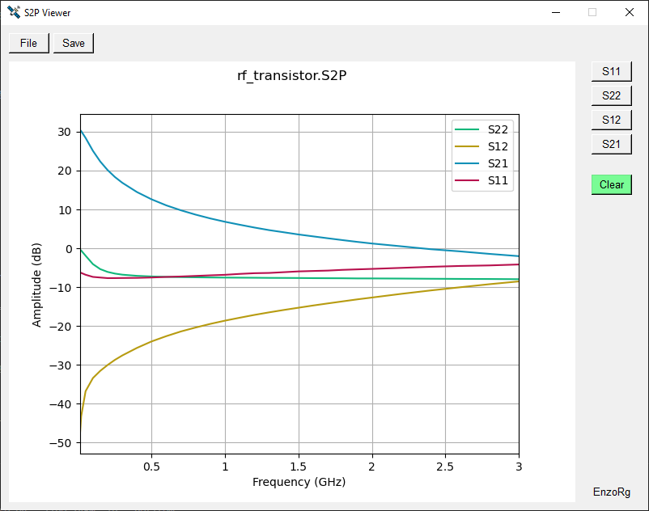

# S2P Viewer - EnzoRg

## Description

S2P Viewer is a graphical application developed in Python for visualizing and analyzing Scattering Parameters files from radiofrequency devices. The program provides an intuitive interface, allowing users to load .s2p files, visualize parameters (S11, S22, S12, S21), and includes functions for clearing the visualization.

## Features

- **Intuitive Graphical Interface:** Simplifies the loading and visualization of .s2p files.
- **Parameter Visualization:** Graphically displays S11, S22, S12, and S21 parameters.
- **Graph Clearing Function:** Allows users to clear the visualization for new data.
- **Easy File Selection:** Utilize the "File" button to easily load .s2p files.
- **Cross-Platform Compatibility:** Developed in Python, the program is compatible with various platforms.

## Usage Instructions

1. Open the program.
2. Use the "Open" button to select an .s2p file.
3. Select the desired parameter (S11, S22, S12, or S21) using the corresponding buttons.
4. Utilize the "Clear" button to reset the visualization for new data.

## Requirements

- Python 3.x
- Libraries: Tkinter, Matplotlib, scikit-rf (skrf)

## Preview

## Author

EnzoRg

## License

This project is licensed under the [MIT License](LICENSE).

